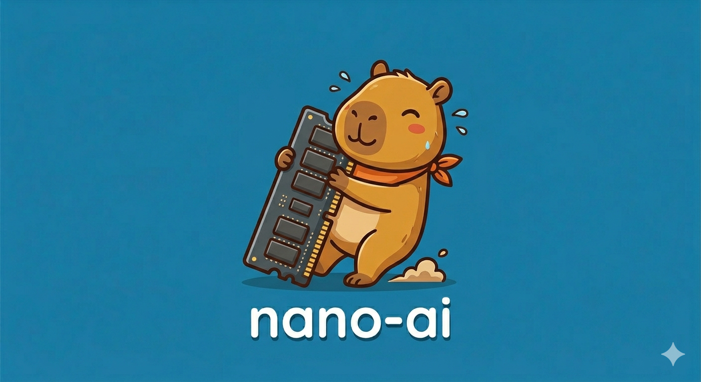

<p align="center">
  
</p>

<h3 align="center">An autonomous AI agent that runs on your laptop.<br>4B parameters. 11/11 autonomous tasks passed.</h3>

<p align="center">
  <a href="https://github.com/axelmitschidev/nano-ai/stargazers"></a>
  <a href="https://github.com/axelmitschidev/nano-ai/blob/main/LICENSE"></a>
  
  
  
  
</p>

---

> A fully autonomous AI agent — browses the web, writes and runs code, manages files — powered by a **4B parameter model** running 100% locally. No cloud. No API key. No telemetry. **One script to install.**

---

## Quickstart

```bash
git clone https://github.com/axelmitschidev/nano-ai.git
cd nano-ai
./setup.sh            # checks Ollama, pulls model, installs deps + browser
.venv/bin/python -m app.main
```

Requires [Ollama](https://ollama.com) (local LLM runtime). `setup.sh` checks for it, pulls the model (~3 GB), creates the venv, and installs dependencies + Chromium.

<details>
<summary>Docker alternative</summary>

```bash
# Mac (Ollama must be running natively for Metal GPU)
docker compose --profile mac up -d --build

# Linux (Ollama included in container)
docker compose --profile linux up -d --build
```

</details>

<details>
<summary>API mode</summary>

```bash
.venv/bin/uvicorn app.server:app --host 0.0.0.0 --port 8000
```

```bash
curl -X POST http://localhost:8000/chat \
  -H "Content-Type: application/json" \
  -d '{"message": "search the web for the latest AI news and save a summary"}'
```

</details>

---

## What can it do?

| Capability | How |
|-----------|-----|
| **Browse the web** | Stealth Chromium browser. Search, read pages, fill forms, click buttons |
| **Write & run code** | Generates Python/JS, executes in sandbox, reads output, iterates |
| **Manage files** | Sandboxed workspace — create, read, delete, persist across sessions |
| **Multi-step reasoning** | Chains tool calls autonomously: search → read → analyze → write |
| **Self-correct** | Detects errors, retries, detects infinite loops, manages context window |
| **Stream in real-time** | SSE endpoint streams thinking, tool calls, and responses as they happen |

---

## Benchmark

We built an [end-to-end benchmark](e2e_bench.py) that tests the agent on real autonomous tasks. Results on a MacBook with **Qwen 3.5 4B**:

| Level | Task | Tools used | Time | Result |
|-------|------|-----------|------|--------|
| L1 | Answer a factual question | — | 21s | **PASS** |
| L1 | Use `get_date` tool | `get_date` | 27s | **PASS** |
| L2 | Write a file to workspace | `write_file` | 30s | **PASS** |
| L2 | Read back the file | `read_file` | 26s | **PASS** |
| L2 | List workspace contents | `list_files` | 84s | **PASS** |
| L3 | Write Python + execute it | `write_file → run_file` | 60s | **PASS** |
| L3 | Debug a buggy script | `read → write → run` | 73s | **PASS** |
| L4 | Search the web | `web_search` | 109s | **PASS** |
| L4 | Read a web page + summarize | `web_read` | 155s | **PASS** |
| L5 | Compute primes + save results | `write → run` | 106s | **PASS** |
| L5 | Research + synthesize + save | `search → read → write` | 297s | **PASS** |

```
  11/11 tasks passed — 8.3 tok/s — peak context 44%
```

Run it yourself (start the server first): `.venv/bin/python e2e_bench.py`

---

## How it works

```
User → "find Python news and save a summary"
         │
         ▼
   ┌─────────────┐
   │ Orchestrator │ ← ReAct loop (max 10 rounds)
   └──────┬──────┘
          │
          ├─→ web_search("Python news")     → results
          ├─→ web_read(best_url)            → markdown
          ├─→ write_file("summary.txt", …)  → saved
          │
          ▼
   "Done. Saved summary to summary.txt."
```

The orchestrator loops through **observe → think → act → observe** until the task is complete. It handles errors, retries, detects loops, and manages its own context window — all with a 4B model on a laptop.

---

## Architecture

```
app/
├── main.py              # CLI client (connects via SSE)
├── server.py            # FastAPI + SSE streaming
├── session.py           # Session store (TTL, eviction, locks)
├── config.py            # Env-based configuration
├── agent/
│   ├── orchestrator.py  # ReAct loop + loop detection
│   ├── context.py       # Sliding window (atomic tool groups)
│   ├── prompt.py        # System prompt + memory injection
│   └── display.py       # Terminal rendering (Rich)
├── llm/
│   ├── port.py          # LLM protocol (swappable backend)
│   └── ollama.py        # Async Ollama client (httpx streaming)
├── tools/
│   ├── registry.py      # Tool registry (add tools without touching core)
│   ├── workspace.py     # Sandboxed file operations
│   ├── browser.py       # Stealth Playwright + DuckDuckGo
│   └── system.py        # Sandboxed code execution
├── logger/
│   └── logger.py        # JSONL audit logs
└── prompts/
    └── system.md        # Agent persona + rules
```

Fully async. Each module does one thing. The LLM backend is swappable — implement `chat()` and `close()`, plug it in.

---

## API

| Method | Route | Description |
|--------|-------|-------------|
| `POST` | `/chat` | Send message, get response |
| `POST` | `/chat/stream` | SSE — real-time events (thinking, tool calls, response) |
| `GET` | `/sessions/{id}/history` | Retrieve conversation |
| `POST` | `/reset?session_id=xxx` | Clear a session |
| `GET` | `/health` | Status check |
| `GET` | `/docs` | Swagger UI |

```bash
# Start a conversation
curl -s -X POST http://localhost:8000/chat \
  -H "Content-Type: application/json" \
  -d '{"message": "hello"}' | jq
# → {"response": "Hi!", "session_id": "abc-123"}

# Continue it
curl -s -X POST http://localhost:8000/chat \
  -H "Content-Type: application/json" \
  -d '{"message": "what time is it?", "session_id": "abc-123"}' | jq
```

---

## Add your own tool

Create one file, register it, done:

```python
# app/tools/my_tool.py
from app.tools import registry

def my_function(query: str) -> str:
    return f"Result for: {query}"

def register_tools():
    registry.register("my_function", my_function,
        "Description the LLM sees when choosing tools.",
        {"type": "object", "properties": {
            "query": {"type": "string", "description": "The search query"},
        }, "required": ["query"]})
```

Then add one line to `app/tools/__init__.py`.

---

## Configuration

| Variable | Default | Description |
|----------|---------|-------------|
| `API_URL` | `http://localhost:11434/api/chat` | Ollama endpoint |
| `API_MODEL` | `huihui_ai/qwen3.5-abliterated:4b` | Model name (any Ollama model works) |
| `API_CTX` | `8192` | Context window (tokens) |
| `API_TOKEN` | — | Auth token for remote LLMs |
| `API_THINK` | `false` | Enable model thinking/reflection |

---

## Why nano-ai?

| | nano-ai | ChatGPT / Claude | AutoGPT / CrewAI |
|---|---------|-------------------|-------------------|
| **Runs locally** | Yes | No | Needs API keys |
| **Cost** | Free | $20-200/mo | API costs |
| **Privacy** | 100% local | Your data on their servers | API calls logged |
| **Web browsing** | Stealth browser | Yes (limited) | Varies |
| **Code execution** | Sandboxed | Restricted | Complex setup |
| **Model size** | 4B (~3GB) | 200B+ | 7-70B+ |
| **Setup time** | ~5 minutes | Account + payment | Hours of config |
| **Extensible** | 1 file = 1 tool | No | Framework-dependent |
| **Works offline** | Yes (except web) | No | No |

---

## Contributing

PRs welcome. See [CONTRIBUTING.md](CONTRIBUTING.md).

---

## License

MIT
